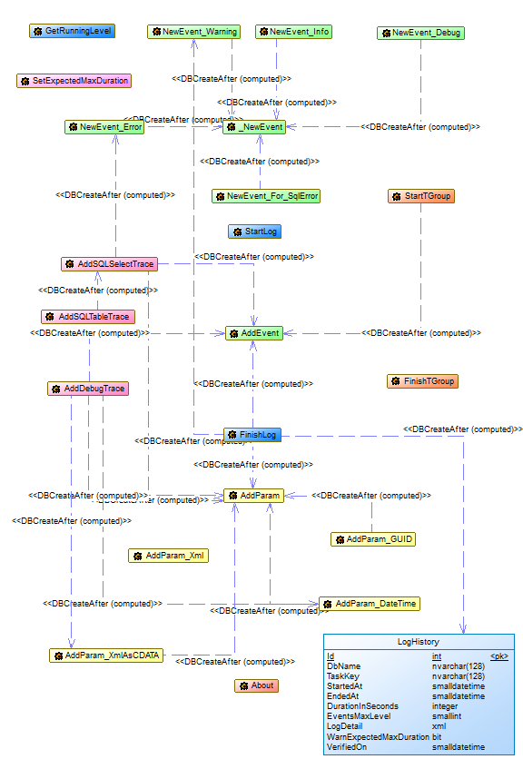

A **logging and tracing system** for SQL stored procedures that survive to a rollback event...

But also *SPLogger-UT** a **Unit Test System** based on It.

# What is SPLogger ?

*SPLogger Release 1.4*

First of all, SPLogger is a set of procedures and functions used to logging Microsoft SQLServer stored procedures execution...  
...that survive to a **rollback** event (if well used).  

But it's also a set of procedures and functions that allows tracing/debugging T-SQL batches.  

And SPLogger:
- Works on SQLServer 2008 and above
- Don't need CLR (Amazon RDS compatible)
- 100% T-SQL code
- Logs are stored in a dedicated database table shareable across user's databases
 
And since release 1.3, SPLogger include **SPLoggerUT** dedicated to **Unit Testing** of stored procedure based on SPLogger. 
 
## How does it work ?
To be able to survive to a rollback event raised during SQL execution, SPLogger use **XML datastructure** to store runtime events/trace logged by the developer.  

During execution of the SQL batch/SP, each *Log Event* is added, on the flow, as a **XML Node** to the *Logger Object* which can be save into the dedicated table *splogger.LogHistory* at the end of the surrounding call and after the **COMMIT** or the **ROLLBACK**.    

The *Logger Object* (XML variable) is passed as **OUTPUT** (byRef) parameter to the SPLogger stored procedures, so it can be filled by sub-routines. 

The logs are saved inside an XML column in a dedicated table. That allows XSLT transformations for User friendly presentation. 

## Which are the SPLogger's functionalities
 - Support 4 levels of logging (DEBUG, INFO, WARNING and ERROR)
 - Support `<sub-log>` which are automatically created when call a SP with its own Logger from an other SP with a Logger
 - The maximum level reached during the execution is memorized as a `<log>` tag attribute. It reflects automatically the maximum level reached by any of its `<sub-log>`
 - Timestamp (UTC) every `<event>`
 - Simplify the creation of an `<event>` filled with all informations available from the last raised Exception (**should** be used inside a CATCH Statement)
 - Compute and memorize as a `<log>` tag attribute the total duration of the execution (from `StartLog`to `FinishLog`)
 - `log`and `event`support `params` tag used to memorize variable/parameters runtime values
 - Support XML variable logging as XML sub-nodes or as CDATA text
 - Support `nb` attribute on WARNING or ERROR `event` to count how many times **in a row** the same `event` has been logged (perhaps due to a `event` logged in a loop). This is used to limit the `log`size.
 - `sql-trace` allows to memorize inside the `log`the result set of a **SELECT** statement or the content of a table
 - `sql-trace` supports the temporary tables created inside the SP. It's awesome to debug from SSMS :-)
 - An *expected maximum duration* can be set for a logger, and a warning will be automatically inserted by `FinishLog` if the running duration is over the expected one
 - Support logging for multiple databases in the same **SPLogger database** throught the use of synonyms to the SPLogger objects
 - Adding `timed-group` which allows developer to group `event`, `sub-logger`, `trace` into areas with a summary duration information. `timed-group` support nesting automatically.
 - Unit Testing system for SP supporting `AssertTrue`, `AssertFalse`, `AssertEquals`, `AssertNotEquals` and `Formulas` using `Values` save during Unit test execution.

# How to install SPLogger ?

## From scratch
SPLogger can be installed in its own database or in an user database without any risk cause it uses its own SQL schema `splogger`.  

If you decide to use a **dedicated database** (SPLogger for example), you have to create it before continuing and you shoud be sure to select this database before running the following SQL scripts.  

If you decide to use an **existing database** (in case of RDS for example), you shoud be sure to select this database before running the following SQL scripts.  

So, installing SPLogger is as simple as execute the following SQL scripts in order :
  - Create `splogger` SQL schema [10-splogger-create-schema](./src/splogger/10-splogger-create-schema.sql)
  - Create all SPLogger SQL objects [20-splogger-create-dbobjects](./src/splogger/20-splogger-create-dbobjects.sql)
  - if needed, create SPLogger Role and set grants to this role [30-splogger-role-grants](./src/splogger/30-splogger-role-grants.sql)
  - if needed (use of a dedicated DB for SPLogger), create synonyms to SPLogger objects to a user defined schema on its own DB [40-splogger-create-synonyms](./src/splogger/40-splogger-create-synonyms.sql)

If you want to use Unit Test system, you should also execute the following SQL scripts in order :
  - Create `sploggerUT` SQL schema [10-sploggerUT-create-schema](./src/sploggerUT/10-sploggerUT-create-schema.sql)
  - Create all SPLogger SQL objects [20-sploggerUT-create-dbobjects](./src/sploggerUT/20-sploggerUT-create-dbobjects.sql)
  - if needed, set grants to this role [30-sploggerUT-role-grants](./src/sploggerUT/30-sploggerUT-role-grants.sql)
  - if needed (use of a dedicated DB for SPLogger), create synonyms to SPLoggerUT objects to a user defined schema on its own DB [40-sploggerUT-create-synonyms](./src/sploggerUT/40-sploggerUT-create-synonyms.sql)

  - Run the SPLogger's tests [99-splogger-and-sploggerUT-tests](./src/99-splogger-and-sploggerUT-tests.sql)

## Upgrading

You can check your current release by looking at the **latest synonym** created for the `LogHistory` table (ex: `History 1.0`). Information: initial release (tag #v1.0) didn't create the synonym.

Upgrade scripts can be found into the `upgrade` folder. You **SHOULD* execute, in order, all scripts from your release to the latest one.

*In order* means, for exemple, to upgrade from 1.0 to 1.3, execute scripts from upgrade/1.0-1.1 followed by scripts from upgrade/1.1-1.2 and finally scripts from upgrade/1.2-1.3.

**Upgrade scripts are cumulative and non destructive for the content of the `LogHistory` table.**

# How to use SPLogger ?

Using SPLogger is simple...  

Just create a logger (@see [toplevel-stored-procedure-template](./templates/toplevel-stored-procedure-template.sql)) and pass it as OUTPUT parameter to all called sub-procedures. It will be filled with `Events` and finally saved in the database.

It's possible to prepare stored procedure to be used as a main or a sub-routine by creating inside it a logger attached to the parent logger (@see [stored-procedure-template](./templates/stored-procedure-template.sql))

Finally, you can pass the logger as output parameter to any stored procedure and use it to log events without creating a sub-logger (good for small procedure).

To get an running sample, you can have a look at [SPLogger and SPLogger-UT Tests](./src/99-splogger-and-sploggerUT-tests.sql)

# How to use SPLogger-UT ?

If you plan to use Unit Testing on your Stored Procedures, you can use templates (@see  [toplevel-stored-procedure-with-UT-template](./templates/toplevel-stored-procedure-with-UT-template.sql) and [stored-procedure-with-UT-template](./templates/stored-procedure-with-UT-template.sql))
as model.

Inside of your SPs, you can use dedicated methods of schema `sploggerUT` like `sploggerUT.SetDateTimeValue`, `sploggerUT.SetNVarcharValue`, `sploggerUT.SetIntValue` or `sploggerUT.SetSqlSelectValue` to memorise some values that you will be able to check after execution.

To create your Unit Test, you can/should base it on the template [unit-test-template](./templates/unit-test-template.sql)

# Database models

## SPLogger

## SPLogger-UT

